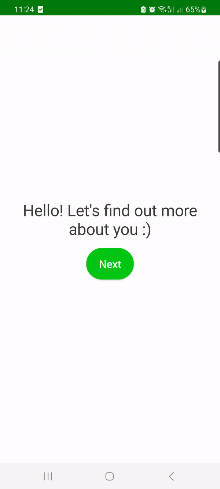
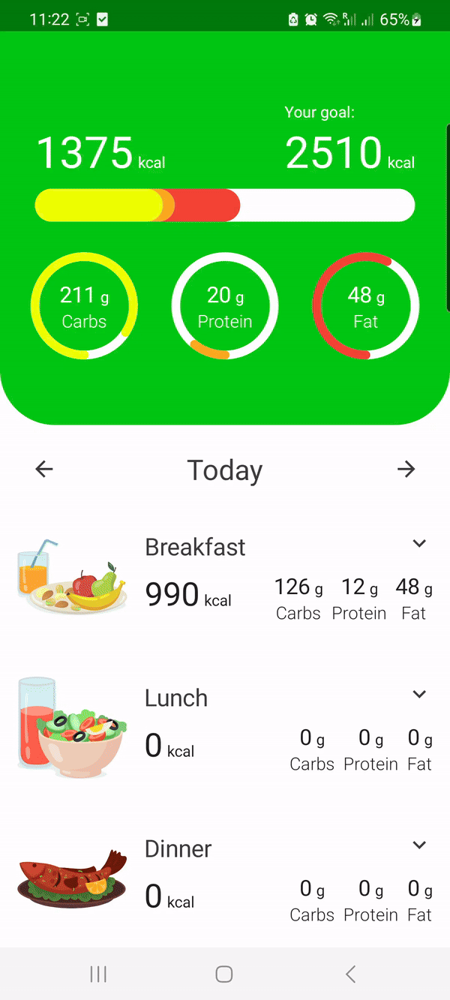

# CalorieTracker
Calorie tracking application, which allows the user to enter their information and nutrition goals in the onboarding section. The main section consists of an overview screen, which lists the meals and calories for a given day and a search screen which allows the user to search for foods using the OpenFoods API and track them to store them in a local database.

## Technologies and Patterns

The example application was made to showcase the use of the following main technologies and patterns:

Kotlin,
Jetpack Compose,
Dagger-Hilt,
Room,
Retrofit,
MVVM,
Clean Architecture,

## Onboarding

## Main

